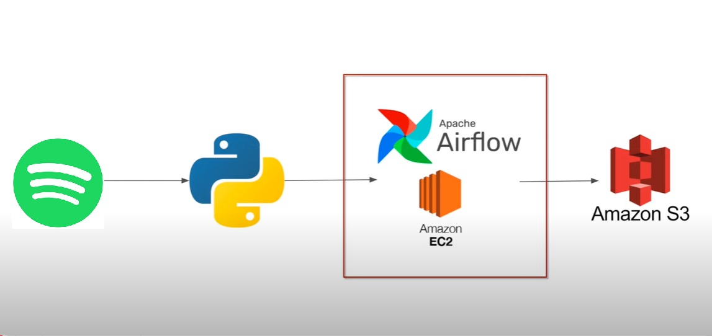

# Spotify Data Pipeline Using Airflow

This project sets up a real-time data pipeline using **Apache Airflow** to extract data from the **Spotify API** and store it in an **AWS S3 bucket**. The instance is hosted on **Amazon EC2** for orchestration.

## Technologies Used:
- Apache Airflow
- Spotify Web API
- AWS S3
- Amazon EC2

## Project Steps:

### 1. Setting Up Airflow on EC2:
```bash
# Update and install necessary packages
sudo apt update
sudo apt install -y python3-pip
pip install apache-airflow

# Start Airflow
airflow db init
airflow webserver --port 8080
```
### 2. Create a DAG for Spotify ETL:

Check the spotify_etl.py and spotify_dag.py files in this repository. These files contain the DAG setup for extracting data from the Spotify API and uploading it to an S3 bucket. Here's a quick overview:

    spotify_etl.py: Handles the Spotify API call and processes the extracted data.
    spotify_dag.py: Defines the Airflow DAG that schedules the tasks for extraction and loading.

### 3. Running the DAG

After setting up Airflow:

    Log in to the Airflow webserver.
    Activate the DAG for Spotify ETL.
    Monitor and manage the pipeline as it runs.


## Architecture 


### Conclusion

This pipeline automates the process of extracting data from the Spotify API and loading it into AWS S3, enabling you to work with real-time data efficiently.
